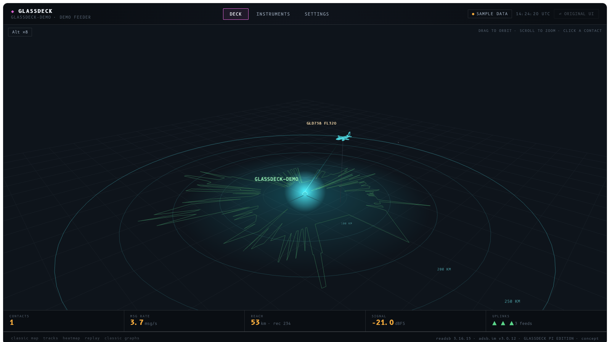
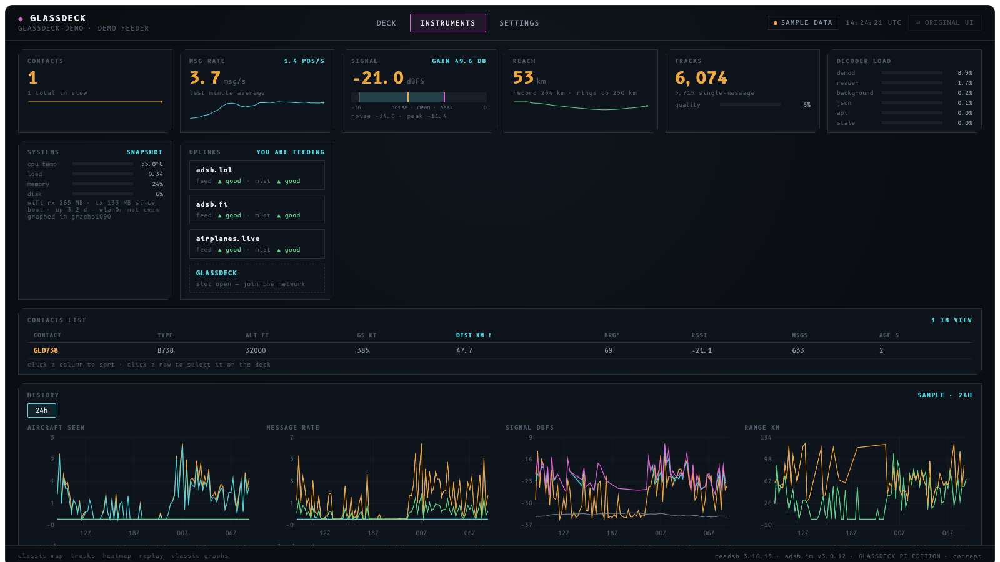
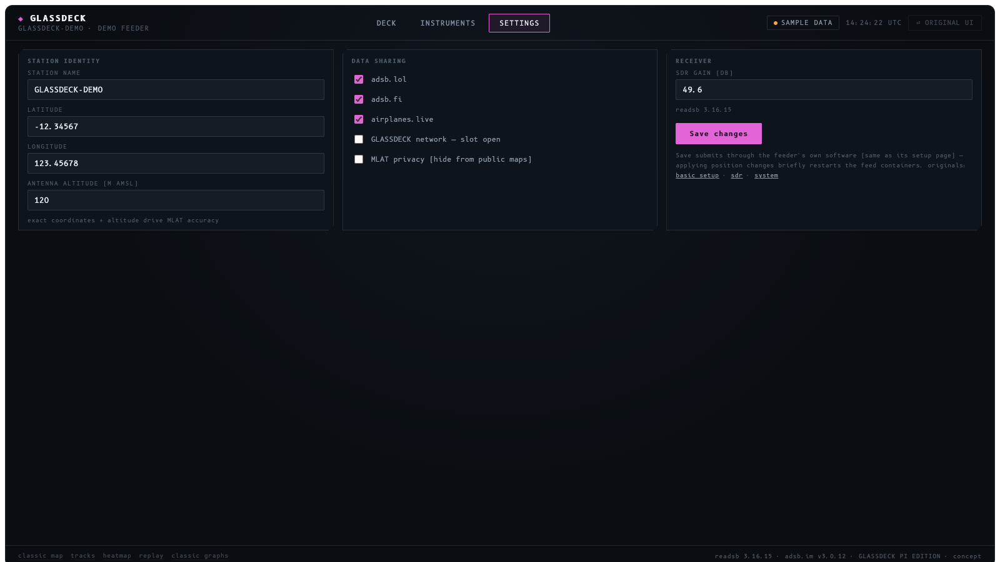

# GLASSDECK

**A holographic cockpit dashboard for your ADS-B feeder.** One self-contained page that
replaces the day-to-day view of tar1090 + graphs1090 + the adsb.im overview — without
touching any of them.



- **Deck** — your live traffic as wireframe-hologram aircraft (typed from each contact's
  real ICAO code) over range rings scaled to *your* antenna's measured reach, drawn by
  lasers from your station at true relative altitudes, with your actual 24 h coverage
  shape traced on the deck. Click a contact for registration, type, operator, distance,
  bearing, RSSI.
- **Instruments** — contacts, message rate, signal, reach, tracks quality, decoder load,
  system health, live per-aggregator uplink status, a sortable contacts table, and full
  multi-series history charts (6 h → 34 d) read from the same archives graphs1090 plots —
  click any chart to enlarge it, click a legend row to show/hide a series.
- **Settings** — station name, coordinates, antenna altitude — applied through the
  adsb.im app's own endpoints (its code stays the owner and validator).
- **⏎ original ui** — the stock dashboard is always one click away, untouched.

| Instruments | Settings |
|---|---|
|  |  |

## Install (adsb.im feeder images)

```
curl -sL https://raw.githubusercontent.com/debeers-labs/glassdeck/main/install.sh | sudo bash
```

Then open `http://<your-feeder>:8080/chunks/glassdeck.html`.

The installer personalises everything automatically from your feeder's own config:
station name, position, altitude, your enabled aggregators — and it *measures* your
range-ring scale from your own 34-day reach record.

## Design principles

- **Read-only against everything that exists.** Live data comes from the same
  `aircraft.json`/`stats.json` tar1090 reads; history comes from the same RRD archives
  graphs1090 plots; settings changes go **through** the adsb.im app's own endpoints —
  this project never writes another tool's files.
- **Zero container modification.** Served from the host-side tmpfs nginx already exposes.
  Survives feeder image updates; self-heals after reboot via cron.
- **Fully reversible.** `sudo /opt/adsb/glassdeck/uninstall.sh` returns the feeder to
  exactly how it was: three cron lines and one folder removed, nothing else ever changed.

## What it touches

| Path | What |
|---|---|
| `/opt/adsb/glassdeck/` | the dashboard + two small python scripts (persistent) |
| `/run/adsb-feeder-ultrafeeder/tar1090/` | served copy + exported JSON (tmpfs) |
| root crontab | three tagged lines: export system metrics (1 min), export history (5 min), self-heal (1 min) |

## Status

Early community pilot. Built and tested on adsb.im v3.0.12 (Raspberry Pi 4, ultrafeeder).
Issues and feedback very welcome — open a GitHub issue or write to
**glassdeck@debeers-labs.xyz**.

## Credits

GLASSDECK is a companion skin, not a replacement, for the excellent stack it sits on:
[readsb](https://github.com/wiedehopf/readsb) and
[tar1090](https://github.com/wiedehopf/tar1090) and
[graphs1090](https://github.com/wiedehopf/graphs1090) by wiedehopf, and the
[adsb.im feeder image](https://github.com/dirkhh/adsb-feeder-image) by Dirk Hohndel.
Aircraft silhouettes and fonts (B612, the Airbus cockpit typeface) are embedded in the page.
